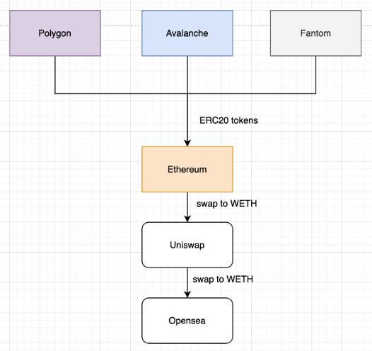
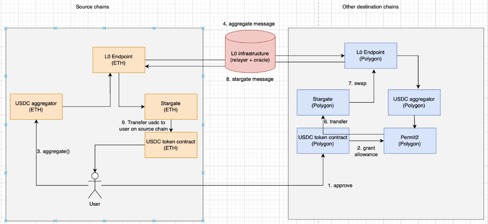

# Cross-chain token aggregator

This project demonstrates a cross-chain token aggregator.

## Problem
1. Fragmented liquidity - ERC20 tokens (e.g. USDC, USDT, WETH) scattered across multiple chains

2. Multiple transactions need to be sent to bridge tokens if you need liquidity on 1 chain -> poor UX

## Scenario
<p align="center">
  
</p>

## Architecture
<p align="center">
  
</p>

## LiquidityAggregator.sol

1. Deploy LiquidityAggregator:

```
npx hardhat --network goerli deploy --tags LiquidityAggregator
npx hardhat --network mumbai deploy --tags LiquidityAggregator
npx hardhat --network fantom-testnet deploy --tags LiquidityAggregator
npx hardhat --network fuji deploy --tags LiquidityAggregator
````

2. Set the remote addresses, so each contract can receive messages
```angular2html
// goerli
npx hardhat --network goerli setTrustedRemote --target-network mumbai --local-contract LiquidityAggregator --remote-contract LiquidityAggregator
npx hardhat --network goerli setTrustedRemote --target-network fuji --local-contract LiquidityAggregator --remote-contract LiquidityAggregator
npx hardhat --network goerli setTrustedRemote --target-network fantom-testnet --local-contract LiquidityAggregator --remote-contract LiquidityAggregator

// mumbai
npx hardhat --network mumbai setTrustedRemote --target-network goerli --local-contract LiquidityAggregator --remote-contract LiquidityAggregator
npx hardhat --network mumbai setTrustedRemote --target-network fuji --local-contract LiquidityAggregator --remote-contract LiquidityAggregator
npx hardhat --network mumbai setTrustedRemote --target-network fantom-testnet --local-contract LiquidityAggregator --remote-contract LiquidityAggregator

// fuji
npx hardhat --network fuji setTrustedRemote --target-network goerli --local-contract LiquidityAggregator --remote-contract LiquidityAggregator
npx hardhat --network fuji setTrustedRemote --target-network mumbai --local-contract LiquidityAggregator --remote-contract LiquidityAggregator
npx hardhat --network fuji setTrustedRemote --target-network fantom-testnet --local-contract LiquidityAggregator --remote-contract LiquidityAggregator

// fantom-testnet
npx hardhat --network fantom-testnet setTrustedRemote --target-network goerli --local-contract LiquidityAggregator --remote-contract LiquidityAggregator
npx hardhat --network fantom-testnet setTrustedRemote --target-network mumbai --local-contract LiquidityAggregator --remote-contract LiquidityAggregator
npx hardhat --network fantom-testnet setTrustedRemote --target-network fuji --local-contract LiquidityAggregator --remote-contract LiquidityAggregator
```
